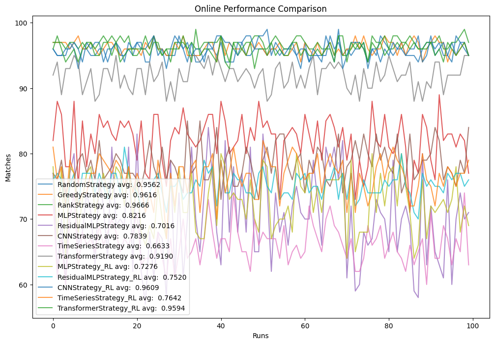

# AI for Online Trichromatic Matching: An Experimentation Study

This repository contains an experimentation study on using Artificial Intelligence and Reinforcement Learning for **Online Trichromatic Matching**. The project explores various strategies to match three distinct sets of entities (e.g., Customers, Restaurants, and Drivers) in real-time as they arrive in a system.

## 📖 Motivation

The core motivation for this study comes from the research paper:
**"Randomized RANKING Algorithm for Online Trichromatic Matching"** (included in the repository as [Randomized_-RANKING_Algorithm_for_Online_Trichromatic_Matching.pdf](./Randomized_-RANKING_Algorithm_for_Online_Trichromatic_Matching.pdf)).

While the paper provides theoretical foundations and randomized algorithms, this study extends the exploration into:
- Deep Reinforcement Learning (DRL) approaches.
- Spatial and temporal constraints in matching.
- Comparative analysis between classical heuristics and AI-driven strategies.

## 🚀 Key Experiments

The main experimental work is conducted in the following notebooks:

- **`Simulation.ipynb`**: The primary playground for general experiments and simulation runs. It utilizes the core simulation engine to test different matching strategies.
- **`runs/A2CSpatial.ipynb`**: Focuses on **Deep Reinforcement Learning for Spatial Tripartite Matching**. It uses combinations of Markovian bases MLP, and Temporal LSTM, Transformer benchmarks algorithms like:
    - Advantage Actor-Critic (A2C)
    - Proximal Policy Optimization (PPO)
    - REINFORCE Policy Gradients
    - Classical Operations Research heuristics.

## 📊 Dataset Generation

Datasets for various matching scenarios are generated and processed within the `test/` and `test2/` directories:

- **Batch-based Matching**: `test/Batch_based_graph.ipynb` - Explores matching after collecting orders over a time window.
- **Spatial-Compatibility Matching**: `test/Spatial_Compatibility_Graph.ipynb` - Generates graphs based on physical distance and feasibility constraints.
- **Scheduling-based Matching**: `test2/scheduling_based_graph.ipynb` - Focuses on job-server-time slot tripartite matching.

Refer to `graph_dataset.md` for a detailed breakdown of the different matching approaches and the data sources used (e.g., Kaggle food delivery datasets).

## 📁 Repository Structure

```text
├── GraphSimulation/      # Core logic for the simulation environment
│   ├── Nodes.py          # Definitions for Customers, Restaurants, Drivers, etc.
│   ├── GraphModel.py     # Environment and state representations
│   ├── GraphStrategy.py  # Base and classical matching strategies
│   ├── GraphAIStrategy.py# AI/RL-based matching strategies
│   └── GraphAITrainer.py # Training loops for RL models
├── runs/                 # RL training runs and specialized experiments
├── test/                 # Dataset generation and validation (Batch/Spatial)
├── test2/                # Dataset generation (Scheduling)
├── Dataset/              # Raw and processed data files
└── Simulation.ipynb      # Main simulation entry point
```

## 🛠️ Setup and Requirements

The project is built using:
- **Python 3.10+**
- **PyTorch**: For Reinforcement Learning models.
- **NetworkX**: For graph-based representations.
- **NumPy & Pandas**: For data manipulation.
- **Matplotlib & Seaborn**: For visualization.

To get started, it is recommended to create a virtual environment and install the necessary dependencies:

```bash
# Example setup
python -m venv .venv
source .venv/bin/activate  # On Windows: .venv\Scripts\activate
pip install torch numpy pandas networkx matplotlib seaborn tqdm
```

## 📈 Results and Visuals



